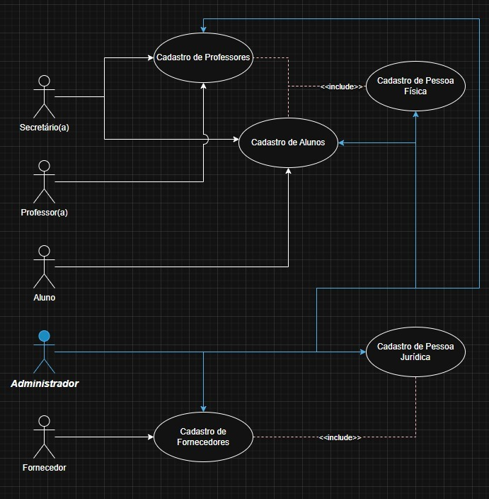
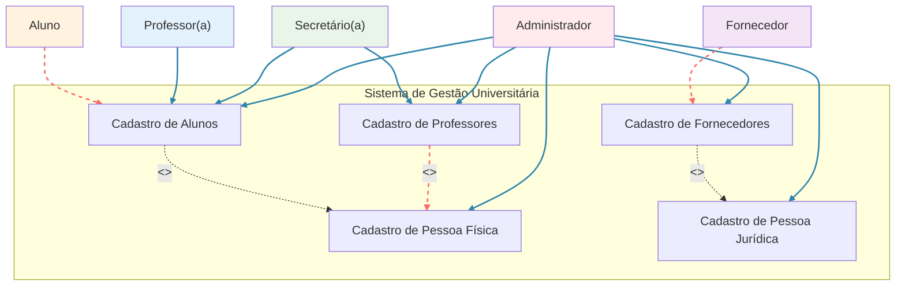
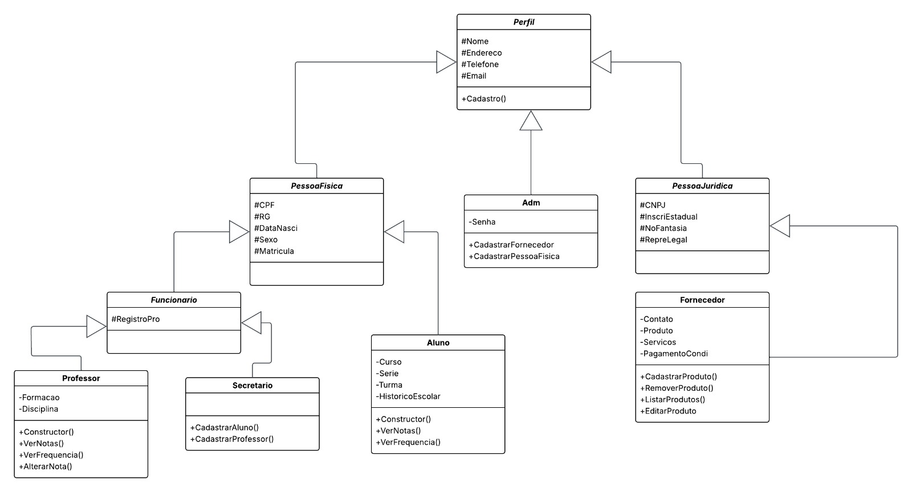
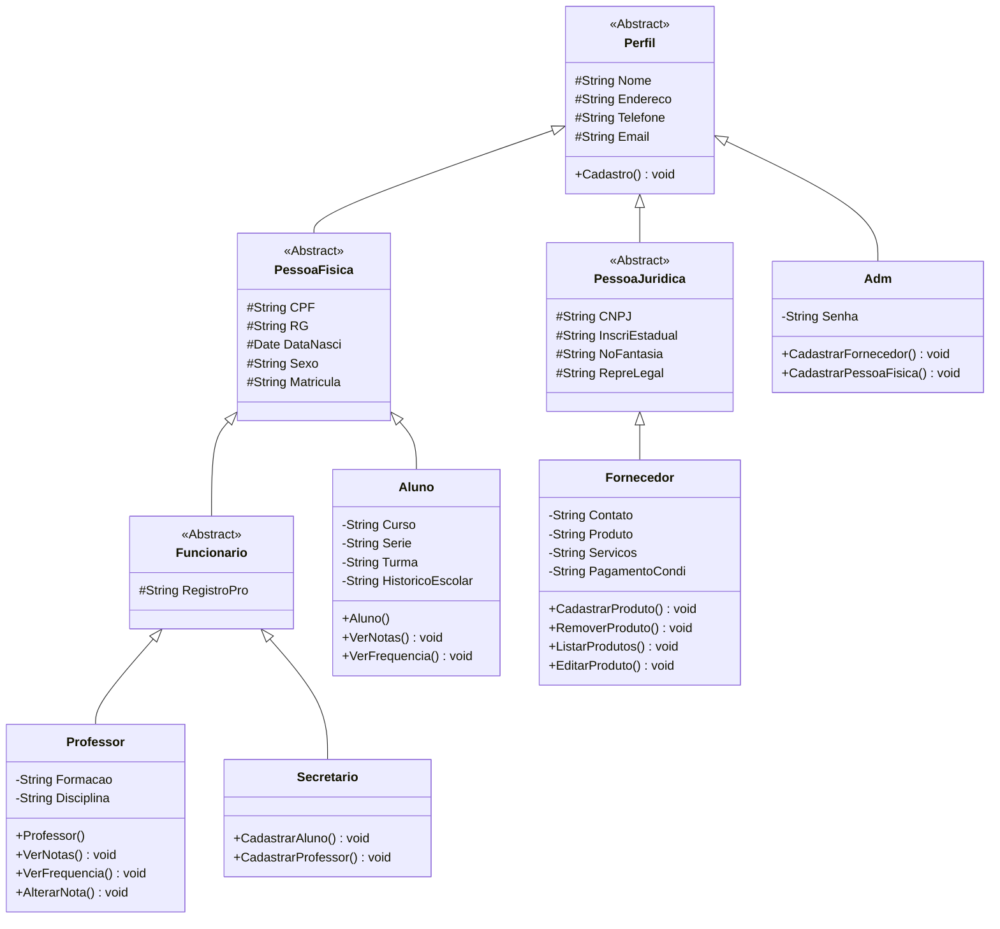

# 🎓 PTI - Gestão de Dados Universitários

Sistema desenvolvido para o Projeto Integrador, focado na gestão e organização de dados da universidade. O repositório reúne documentação, protótipos, diagramas e código utilizado no desenvolvimento da solução.

---

## 📋 Sobre o Projeto

Este projeto visa desenvolver um sistema integrado para gestão de dados universitários, contemplando cadastros de pessoas físicas, jurídicas, professores, fornecedores e alunos, conforme modelagem definida na primeira fase do PI.

---

## 👥 Equipe de Desenvolvimento

| Responsável | GitHub |
|-------------|---------|
| Israel Felipe Chaves da Silva | @Raelmat |
| Kayque Pardim dos Santos | [@github] |
| Marcus Vinícius Campos Machado | [@github] |
| Nathan de Sales Messias | @NathanosPregui |
| Robson Silva de Pinho | [@github] |

---

## 🎯 Funcionalidades Principais

- ✅ **Cadastro de Pessoa Física**
- ✅ **Cadastro de Pessoa Jurídica** 
- ✅ **Cadastro de Professores**
- ✅ **Cadastro de Fornecedores**
- ✅ **Cadastro de Alunos**

---

## 📊 Diagramas da Modelagem

### 📌 Diagrama de Casos de Uso 

## 📘 Diagrama de Classes – Gestão de Dados Universitária

